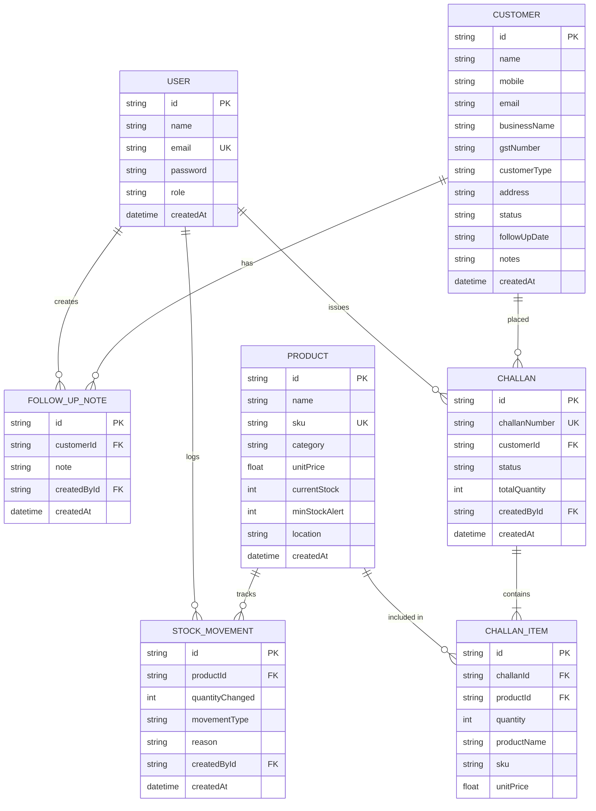

# Mini ERP + CRM Operations Portal — Complete Project Documentation

**Project Name**: Mini ERP + CRM Operations Portal  
**Target Industry**: Wholesale, Distribution & Logistics Operations  
**Architecture**: Full-Stack Monorepo (Node.js + Express + TypeScript + Prisma & React + TypeScript + Vite + Tailwind CSS)  
**Date**: August 2026  

---

## 📋 Table of Contents

1. [Executive Summary](#1-executive-summary)
2. [System Architecture & Technology Stack](#2-system-architecture--technology-stack)
3. [Database Schema & Data Model](#3-database-schema--data-model)
4. [Core Functional Modules](#4-core-functional-modules)
   - [4.1 Authentication & Role-Based Access Control (RBAC)](#41-authentication--role-based-access-control-rbac)
   - [4.2 Customer CRM Module](#42-customer-crm-module)
   - [4.3 Product & Inventory Module](#43-product--inventory-module)
   - [4.4 Sales Challan Module](#44-sales-challan-module)
   - [4.5 Dashboard & UI/UX Layer](#45-dashboard--uiux-layer)
5. [API Specification & Response Shape](#5-api-specification--response-shape)
6. [Security & Architectural Decisions](#6-security--architectural-decisions)
7. [Installation & Local Running Guide](#7-installation--local-running-guide)
8. [Docker & Containerization](#8-docker--containerization)
9. [Cloud Deployment Instructions](#9-cloud-deployment-instructions)
10. [Test Login Credentials & Postman Guide](#10-test-login-credentials--postman-guide)
11. [Known Limitations & Future Enhancements](#11-known-limitations--future-enhancements)

---

## 1. Executive Summary

The **Mini ERP + CRM Operations Portal** is an enterprise-grade full-stack operations management platform designed specifically for wholesale and distribution companies. It streamlines the day-to-day operations of internal teams — including **Sales**, **Warehouse**, **Accounts**, and **System Administrators**.

The platform automates critical business operations:
- **Lead and Customer Management**: Tracking retail, wholesale, and distributor accounts alongside historical follow-up interactions.
- **Inventory & Warehouse Tracking**: Cataloging products, setting minimum stock alert thresholds, and keeping an append-only audit trail of stock movements.
- **Sales Order Fulfillment**: Generating delivery challans with item snapshots and enforcing all-or-nothing atomic stock validation to prevent negative inventory.
- **Multi-Role Security**: Enforcing strict role-based access control (RBAC) across all backend endpoints and frontend interfaces.

---

## 2. System Architecture & Technology Stack

The application is architected as a clean monorepo divided into `/backend` and `/frontend` services.

```
                  +-----------------------------------+
                  |   React + TypeScript Frontend     |
                  |  (Vite + Tailwind CSS + Lucide)   |
                  +-----------------+-----------------+
                                    |
                         REST APIs (JSON / JWT)
                                    |
                  +-----------------v-----------------+
                  |   Node.js + Express Backend       |
                  | (TypeScript + Zod Validation)     |
                  +-----------------+-----------------+
                                    |
                               Prisma ORM
                                    |
                  +-----------------v-----------------+
                  |    PostgreSQL / SQLite Database   |
                  +-----------------------------------+
```

### Backend Tech Stack
- **Runtime & Language**: Node.js (v20+) with TypeScript (v5+)
- **Web Framework**: Express.js
- **ORM & Database**: Prisma ORM with PostgreSQL / SQLite driver
- **Validation**: Zod schema validation middleware
- **Authentication**: JSON Web Tokens (`jsonwebtoken`) & password hashing (`bcryptjs`)
- **Security & Logging**: Helmet HTTP headers CORS, and Morgan logger

### Frontend Tech Stack
- **Framework & Language**: React (v18+) with TypeScript
- **Build Tool**: Vite (v5+)
- **Styling & Icons**: Tailwind CSS (v3+) with custom Glassmorphism utilities & Lucide Icons
- **Routing**: React Router v6 (with Protected Route wrappers)
- **State Management**: React Context API (`AuthContext` for in-memory JWT, `ToastContext` for global popups)

---

## 3. Database Schema & Data Model

The database schema is defined in Prisma (`backend/prisma/schema.prisma`). It features 7 primary models and 5 custom enums.



---

## 4. Core Functional Modules

### 4.1 Authentication & Role-Based Access Control (RBAC)
- **Role Hierarchy**:
  - `ADMIN`: Unrestricted read/write access across all system modules.
  - `SALES`: Full access to Customer CRM and Sales Challans; read-only access to Products & Inventory.
  - `WAREHOUSE`: Full access to Products & Stock Movements; read-only access to CRM & Challans.
  - `ACCOUNTS`: Read-only audit access across all portal modules.
- **Middlewares**:
  - `verifyToken`: Validates `Authorization: Bearer <token>` header, decodes payload, and attaches user context to Express `req.user`. Returns `401 Unauthorized` for missing/expired tokens.
  - `requireRole(...roles)`: Verifies if `req.user.role` matches allowed roles. Returns `403 Forbidden` for insufficient permissions.

### 4.2 Customer CRM Module
- **Features**:
  - **Account Registration**: Create/edit customer profiles (`Retail`, `Wholesale`, `Distributor`) with GST numbers and address details.
  - **Status Lifecycle**: Track customer stage (`Lead`, `Active`, `Inactive`).
  - **Search & Filtering**: Paginated table listing with multi-field search (`name`, `mobile`, `email`, `businessName`) and dropdown filters (`status`, `customerType`).
  - **Follow-up Timeline**: Append historical interaction notes to a customer's profile tagged with author details and timestamps.

### 4.3 Product & Inventory Module
- **Features**:
  - **Catalog Management**: SKU uniqueness enforcement, category mapping, pricing, and warehouse shelf location tracking.
  - **Low Stock Flagging**: Automatic alert indicator (`isLowStock = currentStock <= minStockAlert`) highlighted on UI tables and dashboard.
  - **Append-Only Stock Ledger**: Immutable log (`StockMovement`) tracking stock `IN` or `OUT` with document references.
  - **Stock Deficit Protection**: `POST /products/:id/stock-movements` executes inside an atomic Prisma `$transaction`. If a `Stock OUT` movement would result in `currentStock < 0`, the transaction rolls back and returns **HTTP 409 Conflict**.

### 4.4 Sales Challan Module
- **Features**:
  - **Immutable Product Snapshots**: Each `ChallanItem` stores snapshot data (`productName`, `sku`, `unitPrice`) at the time of order creation. Master product updates will never alter historical challans.
  - **Auto-Generated Challan Numbers**: Formatted as `CH-YYYY-00001`.
  - **Draft Creation**: `POST /challans` saves sales orders as `Draft` without stock validation.
  - **Atomic Confirmation (`Draft -> Confirmed`)**:
    - Executes inside a Prisma `$transaction`.
    - Queries live stock for all line items.
    - If **ANY** item is short, aborts confirmation with **HTTP 409 Conflict** and returns a list of `shortItems` (`sku`, `name`, `requested`, `available`). No partial confirmations.
    - If **ALL** items have stock, decrements product stocks and logs `StockMovement` `OUT` records.
  - **Atomic Cancellation (`Confirmed -> Cancelled`)**: Restores product stock levels and logs `StockMovement` `IN` records inside a `$transaction`.
  - **Printable PDF Export**: View formatted delivery challan document for browser printing or saving as PDF.

### 4.5 Dashboard & UI/UX Layer
- **Real-Time KPI Cards**: Live telemetry showing total customers (by status), master product count, low-stock alert count, and challans breakdown.
- **Recent Activity Widgets**: Displays recent sales challans and active low-stock item warnings.
- **Universal Toast System**: Displays success popups and detailed error toasts (including short-stock breakdown tables).

---

## 5. API Specification & Response Shape

All backend APIs conform to a standardized JSON response contract:

### Success Response (`HTTP 200 / 201`)
```json
{
  "success": true,
  "data": {
    "id": "c1a2b3-uuid",
    "challanNumber": "CH-2026-00001",
    "status": "Confirmed"
  },
  "error": null
}
```

### Error Response (`HTTP 400 / 401 / 403 / 404 / 409`)
```json
{
  "success": false,
  "data": null,
  "error": {
    "message": "Confirmation failed: Insufficient stock available for one or more requested products",
    "details": {
      "shortItems": [
        {
          "sku": "PROD-COPPER-02",
          "name": "Heavy Duty Copper Wire Spool (100m)",
          "requested": 10,
          "available": 4
        }
      ]
    }
  }
}
```

### Complete Endpoint Directory

| Method | Endpoint | Description | Allowed Roles |
| :--- | :--- | :--- | :--- |
| `GET` | `/api/v1/health` | Service health telemetry & DB status | Public |
| `POST` | `/api/v1/auth/login` | Authenticate user & return JWT token | Public |
| `GET` | `/api/v1/auth/me` | Fetch active user profile | All Authenticated |
| `GET` | `/api/v1/customers` | Paginated customer list with search & filters | All Roles |
| `GET` | `/api/v1/customers/:id` | Get customer profile & follow-up notes | All Roles |
| `POST` | `/api/v1/customers` | Add new customer account | Admin, Sales |
| `PUT` | `/api/v1/customers/:id` | Update customer profile | Admin, Sales |
| `POST` | `/api/v1/customers/:id/notes` | Log a new follow-up note | Admin, Sales |
| `GET` | `/api/v1/products` | Paginated product list with low-stock alerts | All Roles |
| `GET` | `/api/v1/products/:id` | Get product details & movement history | All Roles |
| `POST` | `/api/v1/products` | Add new product SKU | Admin, Warehouse |
| `PUT` | `/api/v1/products/:id` | Update product catalog details | Admin, Warehouse |
| `POST` | `/api/v1/products/:id/stock-movements` | Record stock IN/OUT (Atomic $transaction) | Admin, Warehouse |
| `GET` | `/api/v1/products/:id/stock-movements` | Fetch product stock movement audit log | All Roles |
| `GET` | `/api/v1/challans` | Paginated sales challan list | All Roles |
| `GET` | `/api/v1/challans/:id` | Get challan details & snapshot items | All Roles |
| `POST` | `/api/v1/challans` | Create new Draft sales challan | Admin, Sales |
| `PUT` | `/api/v1/challans/:id` | Modify Draft sales challan | Admin, Sales |
| `POST` | `/api/v1/challans/:id/confirm` | Confirm challan & deduct stock (Atomic) | Admin, Sales |
| `POST` | `/api/v1/challans/:id/cancel` | Cancel challan & restore stock (Atomic) | Admin, Sales |

---

## 6. Security & Architectural Decisions

1. **In-Memory JWT Token Storage**:
   - The JWT bearer token is stored strictly in React Context memory (`AuthContext`) instead of `localStorage`.
   - **Security Advantage**: Completely immune to Cross-Site Scripting (XSS) token extraction attacks.
2. **Strict Zod Input Validation**:
   - Every incoming request payload (`body`, `params`, `query`) is validated against Zod schemas before touching any database queries or business logic.
3. **Database Transaction Isolation**:
   - Critical operations (stock movements, challan confirmation, challan cancellation) run inside Prisma `$transaction` blocks to ensure all-or-nothing execution.
4. **SQL Injection Prevention**:
   - All queries use Prisma ORM parameterized queries, completely neutralizing SQL injection vulnerabilities.

---

## 7. Installation & Local Running Guide

### Prerequisites
- **Node.js**: v18.0.0 or higher
- **npm**: v9.0.0 or higher

### Step-by-Step Instructions

1. **Clone & Open Project Workspace**:
   ```bash
   cd d:/ERP-CRM-PROJECT
   ```

2. **Install Monorepo Dependencies**:
   ```bash
   npm install
   cd backend && npm install
   cd ../frontend && npm install
   cd ..
   ```

3. **Initialize Database & Seed Test Data**:
   ```bash
   cd backend
   npx prisma db push
   npm run seed
   cd ..
   ```

4. **Launch Application (One-Command Start)**:
   ```bash
   npm run dev
   ```
   - **Backend API**: `http://localhost:5000`
   - **Frontend App**: `http://localhost:3000`

---

## 8. Docker & Containerization

The repository contains multi-stage `Dockerfile` configurations for both backend and frontend, along with a root `docker-compose.yml`.

### Launching with Docker Compose
```bash
docker-compose up --build
```

- **Backend Container**: Node.js 20 Alpine image running Express API on port `5000`.
- **Frontend Container**: NGINX Alpine image serving production Vite build on port `3000`.
- **Database Container**: PostgreSQL 15 Alpine running on port `5432`.

---

## 9. Cloud Deployment Instructions

### Option A: Frontend (Vercel or Netlify)
1. Import repository into [Vercel](https://vercel.com).
2. Set Root Directory to `frontend`.
3. Set Environment Variable:
   - `VITE_API_BASE_URL` = `https://<YOUR_BACKEND_API_DOMAIN>/api/v1`
4. Deploy!

### Option B: Backend (Render or Fly.io)
1. Create a Web Service on [Render](https://render.com).
2. Set Root Directory to `backend`.
3. Set Build Command: `npm install && npx prisma generate && npm run build`
4. Set Start Command: `npx prisma db push && npm run seed && npm start`
5. Set Environment Variables:
   - `PORT`: `5000`
   - `NODE_ENV`: `production`
   - `DATABASE_URL`: `<YOUR_SUPABASE_OR_RENDER_POSTGRES_URL>`
   - `JWT_SECRET`: `<YOUR_SECRET_KEY>`

---

## 10. Test Login Credentials & Postman Guide

### Test Accounts Table

| Role | Email | Password | Primary Module Access |
| :--- | :--- | :--- | :--- |
| **Admin** | `admin@operations.com` | `Admin123!` | All System Modules (Full Access) |
| **Sales** | `sales@operations.com` | `Sales123!` | Customer CRM & Sales Challans |
| **Warehouse** | `warehouse@operations.com` | `Warehouse123!` | Products, Stock Movements & Inventory |
| **Accounts** | `accounts@operations.com` | `Accounts123!` | Read-Only Operations Audit |

### Postman Collection
A pre-configured Postman Collection file is included in the project root:
- [`Mini_ERP_CRM.postman_collection.json`](file:///d:/ERP-CRM-PROJECT/Mini_ERP_CRM.postman_collection.json)
- Import it into Postman to test all authentication, CRM, inventory, and challan requests out-of-the-box.

---

## 11. Known Limitations & Future Enhancements

- **PDF Generation**: Currently uses clean native browser print stylesheet (`@media print`). Future updates could integrate `pdfmake` or `puppeteer` for automated server-side PDF generation.
- **Refresh Token Mechanism**: Current auth uses in-memory JWT tokens with 1h expiry. Adding HttpOnly refresh cookies would allow seamless session retention across hard browser refreshes.
- **Purchase Orders Module**: Can be extended to track inward purchase orders from external suppliers.
